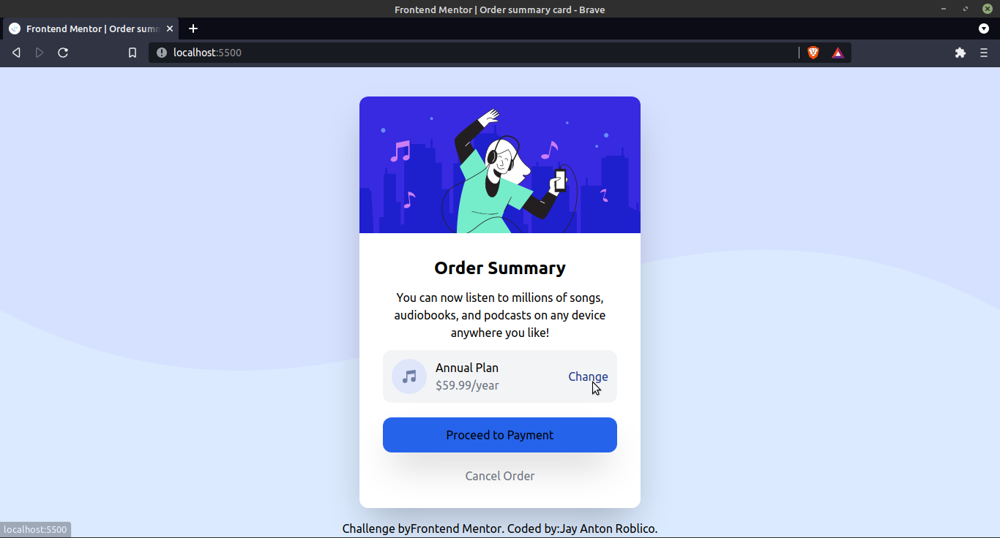

# Frontend Mentor - Order summary card solution

This is a solution to the [Order summary card challenge on Frontend Mentor](https://www.frontendmentor.io/challenges/order-summary-component-QlPmajDUj). Frontend Mentor challenges help you improve your coding skills by building realistic projects. 

## Table of contents

- [Frontend Mentor - Order summary card solution](#frontend-mentor---order-summary-card-solution)
  - [Table of contents](#table-of-contents)
  - [Overview](#overview)
    - [The challenge](#the-challenge)
    - [Screenshot](#screenshot)
    - [Links](#links)
    - [Built with](#built-with)
    - [What I learned](#what-i-learned)
    - [Useful resources](#useful-resources)
  - [Author](#author)

## Overview

### The challenge

Users should be able to:

- See hover states for interactive elements

### Screenshot

### Links

- Live Site URL: [Demo](https://infallible-swanson-5f1efb.netlify.app/)

### Built with

- Semantic HTML5 markup
- [Tailwind](https://tailwindcss.com/docs) - Docs

**Note: These are just examples. Delete this note and replace the list above with your own choices**

### What I learned

I learned the basics of using tailwind.

### Useful resources

- [Tailwind Docs](https://tailwindcss.com/) - This helped me for XYZ reason. I really liked this pattern and will use it going forward.

## Author

- Website - [Jay Anton Roblico](https://www.jayantonroblico.tech)
- Frontend Mentor - [@saerdyey](https://www.frontendmentor.io/profile/saerdyey)
- Twitter - [@saerdyey](https://www.twitter.com/saerdyey)
